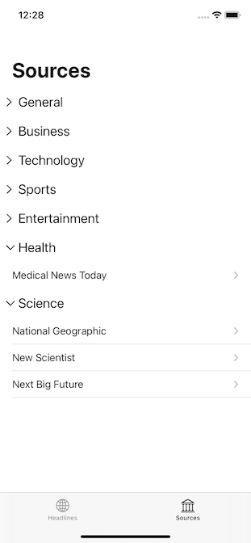

# DailyNews
> Small iOS client showing news from [News API](https://newsapi.org/).

## Table of Contents
* [General Info](#general-info)
* [Features](#features)
* [Setup](#setup)
* [Screenshots](#screenshots)
* [Feedback](#feedback)


## General Info
A small and clean iOS app for reading live news sourced from News API. Using 100% programmatic UI and no 3rd party modules.

### Technologies used
* Xcode 12
* Swift 5
* iOS 13
* UIKit
* 100% programmatic UI (no storyboard)
* UITableView (both regular and diffable)
* Collapsible sections in table view
* Networking using URLSession
* JSON parsing using JSONDecoder
* Public API
* Async download of images
* SwiftLint
* Dark mode support

## Features
✅ Show news headlines  
✅ Search in news  
✅ Show article in WKWebView  
✅ Share article  
✅ Show sources  
✅ Show source info  
#### ToDo
❇️ Filter sources based on country and/or language  
❇️ Filter headlines based on country and/or language  
❇️ Mark articles to read later  


## Setup
To run this app you need to register an account at the News API service ([newsapi.org](https://newsapi.org)) and get an API key. Put this key in file called `Key.plist` and you should be all set. For your conveninence, a `Key-SAMPLE.plist` file has been included in the project.

```
<?xml version="1.0" encoding="UTF-8"?>
<!DOCTYPE plist PUBLIC "-//Apple//DTD PLIST 1.0//EN" "http://www.apple.com/DTDs/PropertyList-1.0.dtd">
<plist version="1.0">
<dict>
  <key>apiKey</key>
  <string>YOUR_API_KEY_HERE</string>
</dict>
</plist>
```

### SwiftLint
This project uses [SwiftLint](https://github.com/realm/SwiftLint) in order to enforce Swift style and conventions. Some minor adjustments to the default rules in SwiftLint can be found in the file `.swiftlint.yml`.

## Screenshots

| Headlines | Search | Article View |
| -------- | --------- | --------- |
|  |  |  |

| Sources | Source View |
| -------- | --------- |
|  |  |

## Feedback
Issues and PR:s are encouraged and highly welcome.

